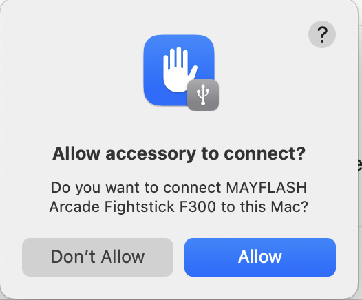
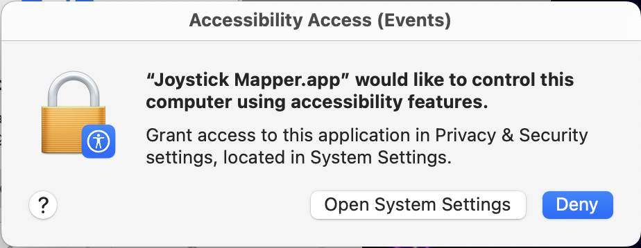
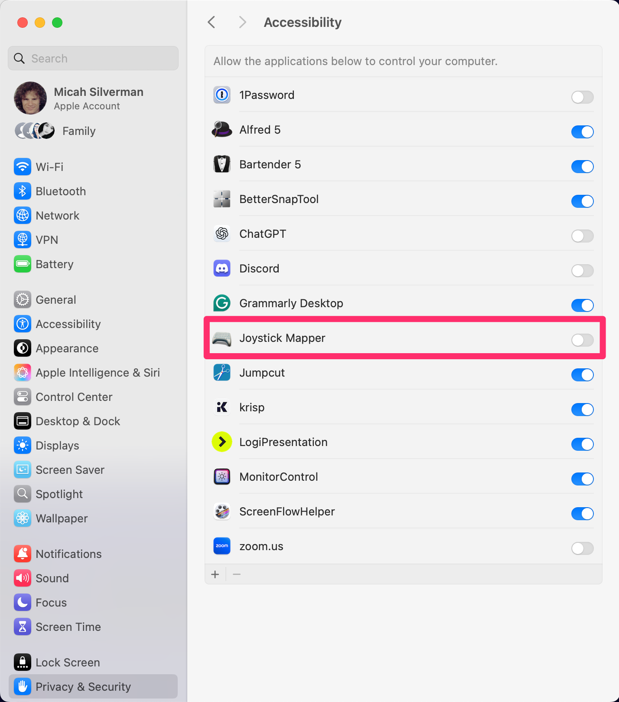
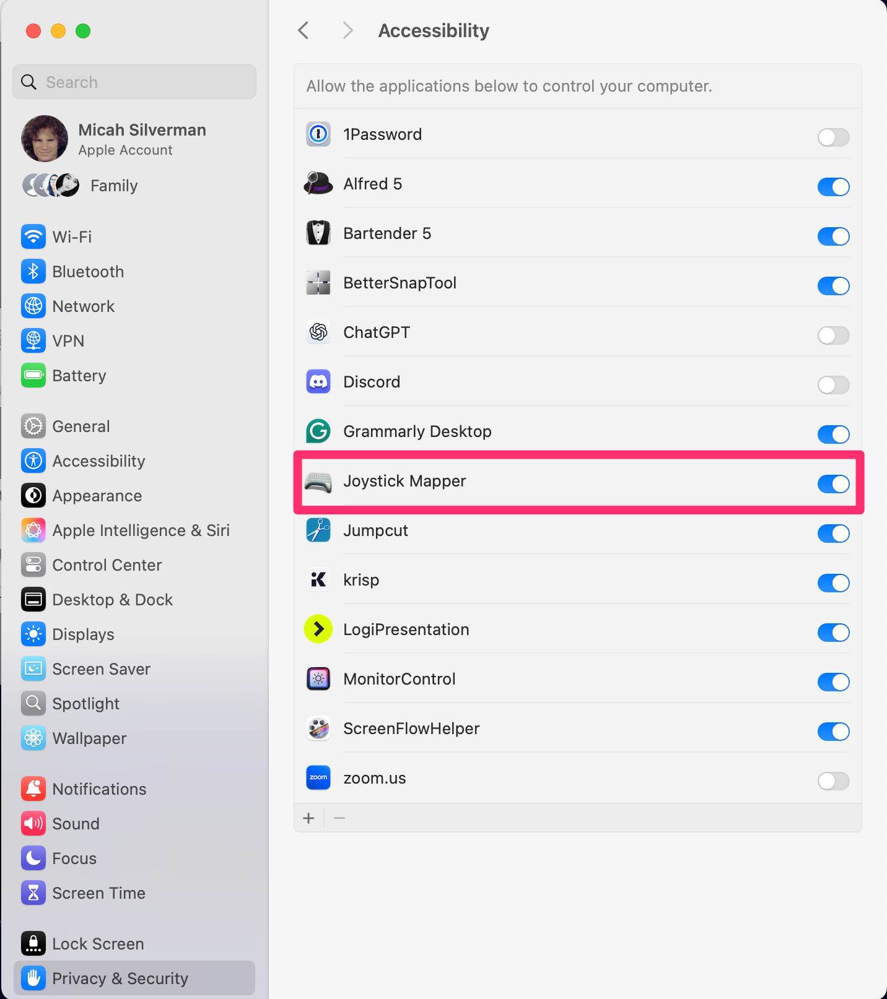
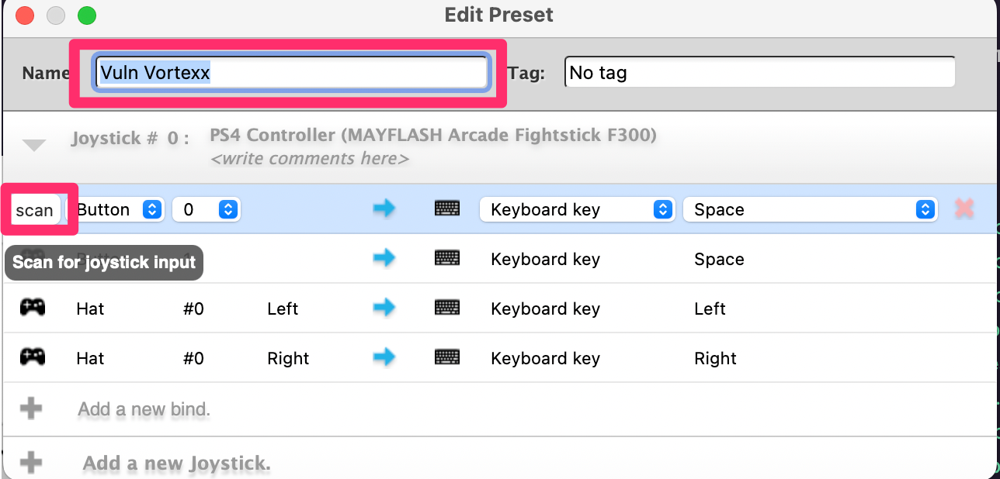
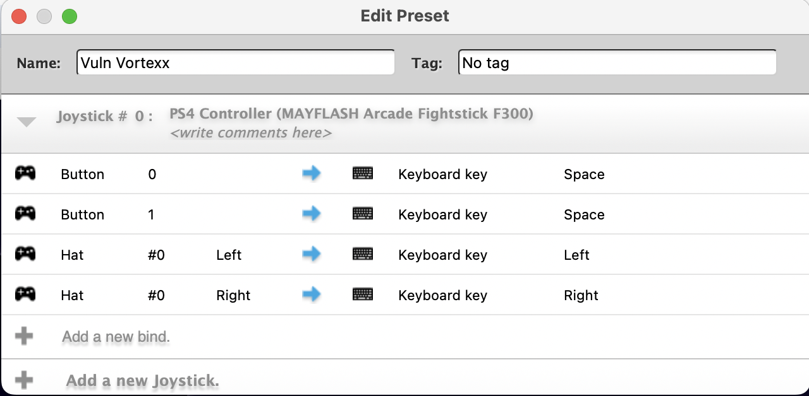
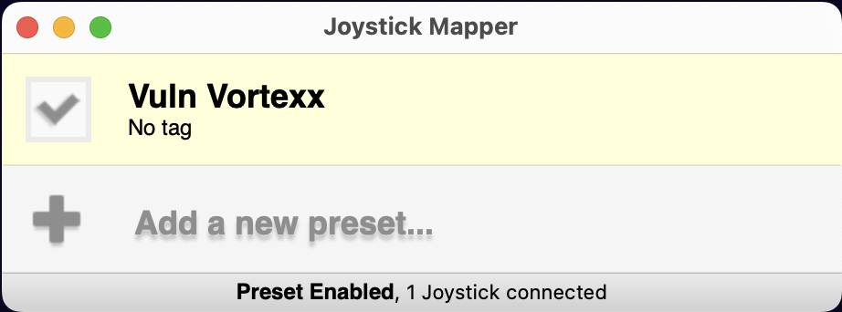

## Set up Joystick on Mac

This doc gives an overview on how to set up the Arcade Stick F300 for Mac.

### Requirements

1. [Arcade Stick F300](https://www.amazon.com/dp/B019MFPLC0?th=1)
2. [Joystick Mapper](https://apps.apple.com/us/app/joystick-mapper/id528183797?mt=12)

### Getting your Mac to Recognize the Arcade Stick

Following the instructions below, you map left, right and space bar buttons on the keyboard to the joystick and buttons on the `Arcade Stick`.

First, plug the `Arcade Stick` into an available USB port on the Mac.

**NOTE:** You may get a pop-up to allow the accessory to connect. Click `Allow`.

Next, launch the `Joystick Mapper` app. You get a pop-up to enable accessibility features.

Click `Open System Settings`. `Joystick Mapper` will be disabled by default.

Click the slide switch to enable `Joystick Mapper`.

### Mapping the Keyboard

Click `Add a new preset...` in the `Joystick Mapper` app.

This brings up the mapping interface. You can name the preset and `scan` for joystick movement or button press from here. 

Add mappings by choosing `scan` on the left, moving the joystick or pressing the button and then choosing a keyboard key on the right.

For this game, you only need to map left and right on the joystick to the left and right arrow keys and map the first two buttons to the space bar.

Close the mapping window. The last step is to click the checkbox to the left of the new mapping  you've created to enable it.

### Testing

Navigate to [https://www.vulnvortex.com](https://www.vulnvortex.com).

Pressing either of the left most buttons on the `Arcade Stick` should start the game.

While in the game, you can move the joystick left and right to move Patch left and right. And, pressing either of the buttons should make Patch jump.

If you get hit by a vuln, you can restart the game by pressing either of the buttons again.